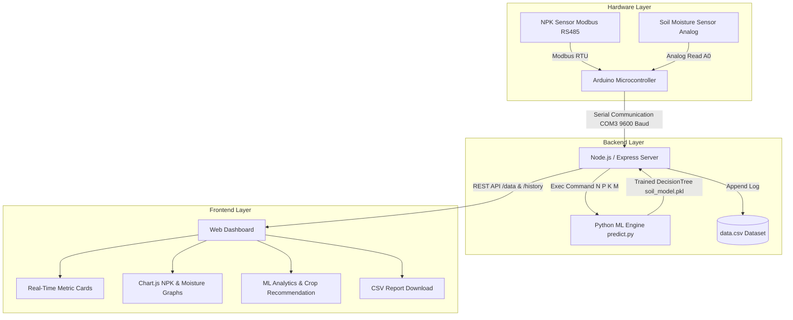

# Smart Soil Nutrient and Moisture Monitoring System Using IoT and Machine Learning 🌾📊

[](https://nodejs.org/)
[](https://www.python.org/)
[](https://www.arduino.cc/)
[](https://expressjs.com/)
[](https://scikit-learn.org/)
[](LICENSE)

An end-to-end Smart Agriculture solution combining **IoT-based hardware sensing**, **Node.js backend data streaming**, **Python Machine Learning crop recommendation**, and a responsive **Web Dashboard** for real-time soil health monitoring and analytics.

---

## 📋 Table of Contents
- [Overview](#-overview)
- [Key Features](#-key-features)
- [System Architecture](#-system-architecture)
- [Hardware & Circuit Setup](#-hardware--circuit-setup)
- [Machine Learning Engine](#-machine-learning-engine)
- [Project Directory Structure](#-project-directory-structure)
- [Installation & Getting Started](#-installation--getting-started)
- [API Endpoints](#-api-endpoints)
- [Usage Guide](#-usage-guide)
- [Future Scope](#-future-scope)
- [License](#-license)

---

## 🌟 Overview

Soil nutrient degradation and improper crop selection are major challenges in modern agriculture. This project presents an automated, intelligent soil monitoring system that:
1. Measures **Nitrogen (N)**, **Phosphorus (P)**, **Potassium (K)**, and **Soil Moisture (M)** levels using Modbus RS485 and analog sensors.
2. Streams live sensor telemetry via Arduino Serial to a **Node.js / Express** web server.
3. Executes a **Machine Learning Decision Tree Classifier** in real-time to recommend the most suitable crop (e.g., Millet, Sorghum, Maize, Wheat, Rice) based on current, hourly, and daily average soil conditions.
4. Visualizes telemetry and ML analytics through an interactive **Chart.js Web Dashboard** and logs continuous data to CSV format for export and analysis.

---

## ✨ Key Features

- **Real-Time Telemetry Acquisition:** Reads live NPK nutrient values via Modbus RS485 and soil moisture via analog pins every 5 seconds.
- **AI-Powered Crop Recommendation:** Evaluates NPK and moisture metrics through a trained Decision Tree model to suggest suitable crops instant-by-instant.
- **Hourly & Daily Trend Averaging:** Aggregates incoming readings to generate 1-hour and 24-hour smoothed crop recommendations.
- **Interactive Web Dashboard:** Modern UI built with HTML5, CSS3, dynamic tabs, live metric cards, and Chart.js real-time line charts.
- **Automated Data Logging:** Appends timestamped sensor readings directly to a local `data.csv` dataset.
- **Report & Data Export:** Dedicated web portal allowing direct CSV dataset downloading and in-browser previewing.

---

## 📐 System Architecture



---

## 🔌 Hardware & Circuit Setup

### Components Required
- **Microcontroller:** Arduino Uno / Nano / Mega
- **Sensors:**
  - 7-in-1 / 3-in-1 Soil NPK Sensor (RS485 Modbus RTU interface)
  - Capacitive Soil Moisture Sensor v1.2 / Analog Soil Moisture Sensor
- **Interface Modules:** MAX485 TTL to RS485 Converter Module
- **Power Supply & Cabling:** 12V Power supply (for NPK Sensor), USB Type-A to B cable, Jumper Wires

### Pin Connections

| Component Module | Arduino Pin | Description |
| :--- | :--- | :--- |
| **MAX485 DI (Data In)** | Pin 10 | SoftwareSerial TX |
| **MAX485 RO (Receive Out)** | Pin 11 | SoftwareSerial RX |
| **MAX485 DE & RE** | Pin 8 | Digital Control (HIGH = Transmit, LOW = Receive) |
| **Soil Moisture Sensor** | Pin A0 | Analog Read |
| **MAX485 VCC / GND** | 5V / GND | Module Logic Power |
| **NPK Sensor Power** | 12V DC External | Sensor Supply |

---

## 🧠 Machine Learning Engine

The machine learning model classifies soil parameters into optimal crop choices.

- **Algorithm:** Decision Tree Classifier (`scikit-learn`)
- **Input Features:** `[Nitrogen (N), Phosphorus (P), Potassium (K), Moisture (M)]`
- **Output Target:** `Crop` (*Millet, Sorghum, Maize, Wheat, Rice*)
- **Dataset:** `crop_dataset.csv`
- **Model Storage:** `soil_model.pkl` (serialized via `joblib`)

### Training the Model
To re-train or update the ML model with new dataset rows:
```bash
python train_model.py
```

### Manual Inference Test
Test predictions directly from CLI:
```bash
python predict.py <N> <P> <K> <Moisture>
# Example: python predict.py 20 15 25 700 -> Output: Maize
```

---

## 📁 Project Directory Structure

```
.
├── Assets/                # UI images, logo, and background assets
├── CSS/                   # Structured CSS stylesheets (base, layout, components, pages)
│   ├── base.css
│   ├── components.css
│   ├── layout.css
│   └── pages.css
├── Js/                    # Frontend JavaScript logic
│   ├── analytics.js       # ML analytics view updater
│   ├── charts.js          # Chart.js initialization & live updates
│   ├── dashboard.js       # Live sensor data polling
│   ├── navigation.js      # Page section tab switching
│   └── reports.js         # CSV download & preview handlers
├── index.html             # Main dashboard frontend entry point
├── server.js              # Express web server & Serial Communication bridge
├── train_model.py         # ML model training script
├── predict.py             # CLI inference script executed by Express
├── soil_model.pkl         # Trained scikit-learn Decision Tree model
├── crop_dataset.csv       # Training dataset for crop classification
├── data.csv               # Live logged sensor readings dataset
├── without_bluetooth.ino  # Arduino C++ sketch for NPK & Moisture reading
└── package.json           # Node.js project dependencies & scripts
```

---

## 🚀 Installation & Getting Started

### 1. Prerequisites
- **Node.js** (v16.x or higher)
- **Python** (v3.8 or higher) with `pandas`, `scikit-learn`, and `joblib` installed
- **Arduino IDE** with `SoftwareSerial` and `ModbusMaster` libraries

### 2. Python Dependencies
Install required Python libraries:
```bash
pip install pandas scikit-learn joblib
```

### 3. Node.js Setup
Clone the repository and install Node.js dependencies:
```bash
git clone https://github.com/ahalyamuddana/Smart-Soil-Nutrient-and-Moisture-Monitoring-System-Using-IOT-and-Machine-Learning.git
cd Smart-Soil-Nutrient-and-Moisture-Monitoring-System-Using-IOT-and-Machine-Learning
npm install
```

### 4. Upload Arduino Sketch
1. Connect Arduino via USB to your system.
2. Open `without_bluetooth.ino` in the Arduino IDE.
3. Select your Board and COM Port.
4. Upload the code.

### 5. Configure Serial Port
Open `server.js` and verify the COM port matches your Arduino connection (default is `COM3`):
```javascript
const serial = new SerialPort({
  path: "COM3", // Update to your port (e.g. COM4 or /dev/ttyUSB0)
  baudRate: 9600
});
```

### 6. Run the Application
Start the Node.js server:
```bash
npm start
```
Open your browser and navigate to:
```
http://localhost:3000
```

---

## 📡 API Endpoints

| Endpoint | Method | Description |
| :--- | :--- | :--- |
| `GET /` | `GET` | Serves the main Web Dashboard (`index.html`). |
| `GET /data` | `GET` | Returns JSON containing latest live readings (N, P, K, M) and ML crop predictions (instant, hourly, daily). |
| `GET /history` | `GET` | Returns full logged history from `data.csv` in JSON format. |
| `GET /download` | `GET` | Downloads the timestamped `data.csv` file directly. |

---

## 🖥️ Usage Guide

1. **Home View:** Provides a high-level summary of the system architecture and key features.
2. **Live Dashboard:** Displays real-time numerical readings for Nitrogen, Phosphorus, Potassium, and Soil Moisture alongside live dynamic charts and instantaneous ML crop predictions.
3. **ML Analytics:** Displays short-term (1 Hour) and long-term (24 Hour) rolling recommendations to assist long-term crop rotation decisions.
4. **IoT Connectivity:** Visualizes detailed component specifications and system data-flow pipeline.
5. **Reports Tab:** Allows exporting recorded field data to CSV for offline analysis.

---

## 🔮 Future Scope

- [ ] Automated Fertigation Pump control via Relay switch triggers.
- [ ] Wireless ESP32/Wi-Fi or GSM connectivity for remote cloud hosting (Firebase / AWS IoT).
- [ ] Integration of expanded soil metrics (pH, Temperature, Conductivity).
- [ ] Mobile app interface (Flutter / React Native) with SMS alerts for critical soil nutrient deficits.

---

## 📄 License

This project is licensed under the [ISC License](LICENSE).

---
*Created as part of Smart Soil Health & Precision Agriculture Research.*
